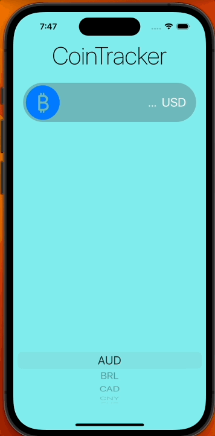
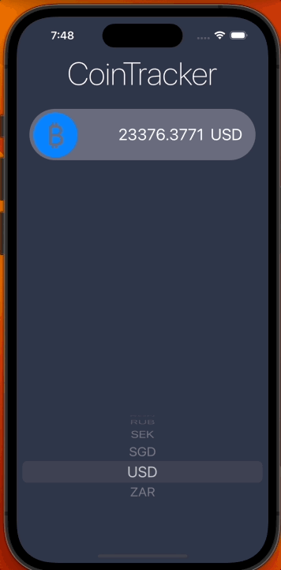

#  CoinTracker App

CoinTracker is an iOS app targeted for iOS 16.1. The app tracks the price of 
Bitcoin in different currencies, which is retrieved using coinapi.io's API.

## Implementation Strategy

### Key takeaways

- This app follows the MVC design pattern.
- The UI was made programmatically using UIKit and AutoLayout.
- The project was build and compiled using Xcode 14.1.0

The goal of this project was to practice networking in iOS development, 
doing API calls and handling JSON responses to parse them into native Swift 
objects using the `JSONDecoder` object from Swift, as well as delegating
responsibilities across classes using the **Delegate** pattern.

To prevent the API key used from leaking in the public repo, the key was
stored in a CoinAPI-Info.plist in a property called `API_KEY`, which is later
retrieved within the app to perform the API calls.

## Demo

### Light Mode

### Dark Mode

